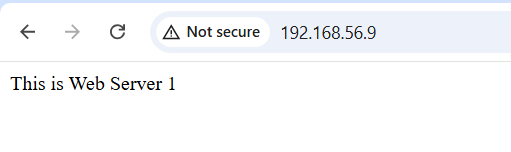
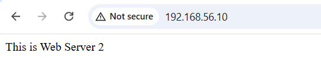
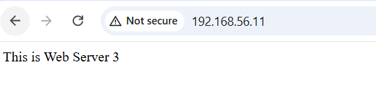
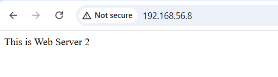
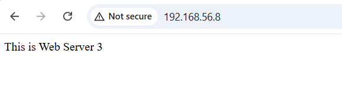
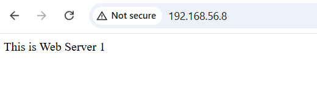
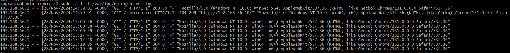
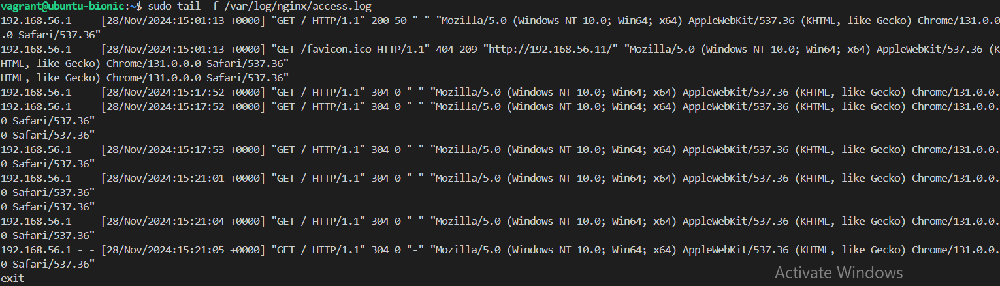

# Step1: Verifying Connectivity
## The screenshots below show that the load balancer can reach the three webservers

# Step2: Test load balancing in a web browser
## The screenshots below show demonstrate load balancing in action. with a single ip address 192.168.56.8, traffic is being directed randomly to the webservers

# Step3: Checking access logs for the webserver 2 and 3.

