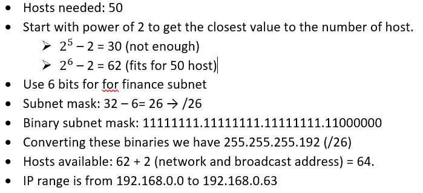
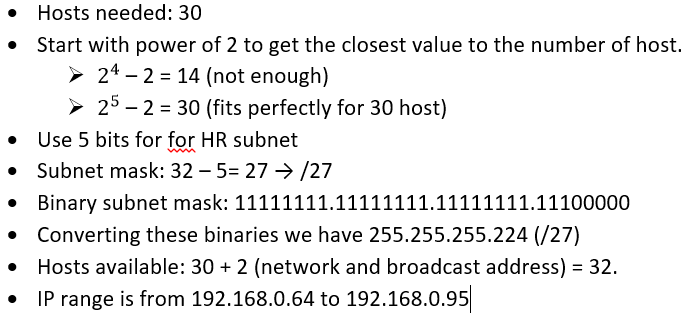
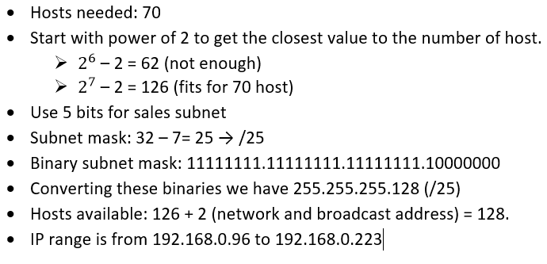
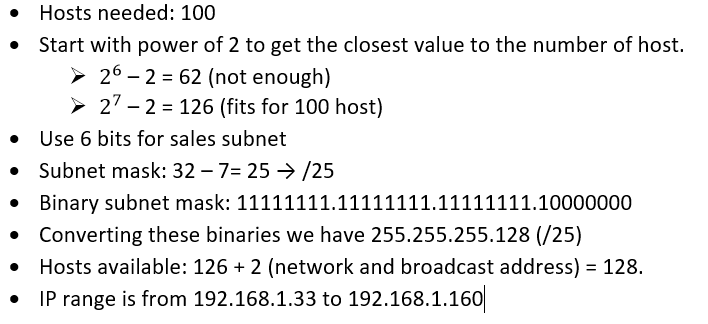
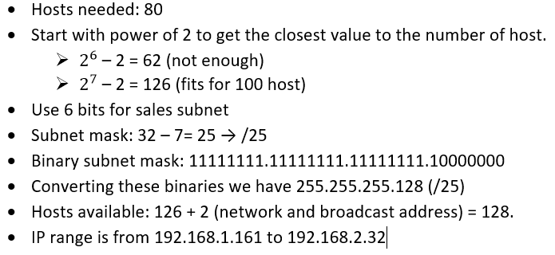

IP addresses and subnet masks are binary (1s and 0s) and each subnet needs a certain number of **bits** for hosts. The formula is shown below, however subtracting 2 for the network and broadcast address: .

The **subnet mask** is a 32-bit number used to divide an IP address into the network part and the host part.

For each of the 6 subnets given in this labguide, I will be showing the IP allocation of each subnet and the subnet masking.

## **Subnet1: Finance (50 hosts)**

## **Subnet2: Human Resources (30 hosts)**

## **Subnet3: Sales (70 hosts)**

## **Subnet4: Marketing (40 hosts)**

## **Subnet5: IT (100 hosts)**

## **Subnet6: Operations (80 hosts)**

## The documentation is shown in the table below:
